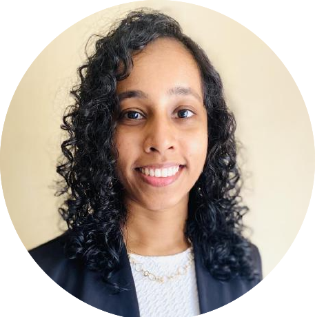
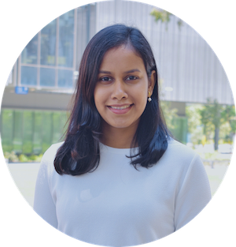
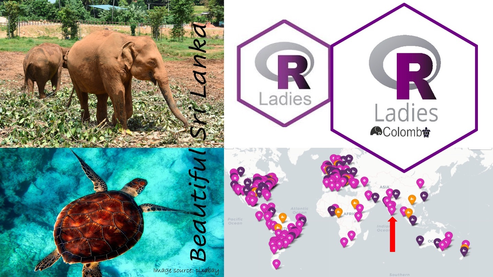
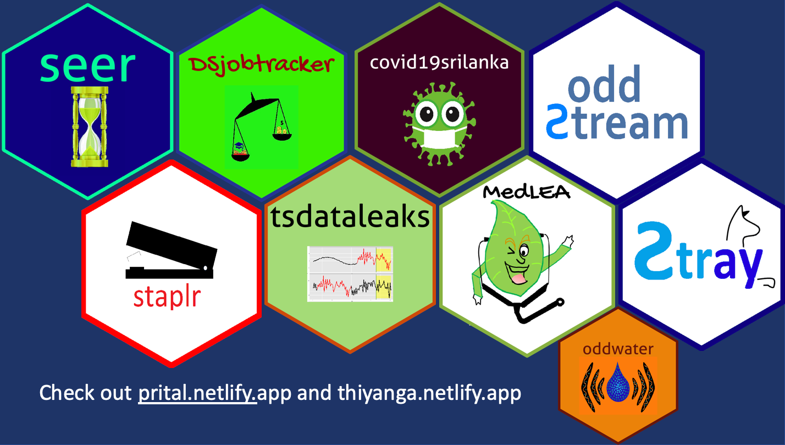

```{r setup, include=FALSE}
library(knitr)
options(htmltools.dir.version = FALSE)
opts_chunk$set(
  warning = FALSE,
  message = FALSE,
  echo = FALSE,
  cache.path = 'cache/',
  fig.align = 'center',
  cache = FALSE
)
library(anicon)

```
```{r xaringan-themer, include=FALSE, warning=FALSE}
library(xaringanthemer)
style_mono_accent(
   base_color = "#002c54",
   title_slide_background_color = "#031642",
  inverse_background_color = "#002c54",
  header_font_google = google_font("Josefin Sans"),
  text_font_google   = google_font("Montserrat", "300", "300i"),
  code_font_google   = google_font("Fira Mono"),
  title_slide_text_color = "#ffea00",
  inverse_header_color = "#ffea00",
   header_background_text_color = "#ffea00",
   text_font_size = "1.2rem",
   text_font_url = "#ffea00",
  header_font_url = "#ffea00",
  inverse_link_color = "#d70dde"
  )
```


class: inverse, middle, center

# Who we are?
---
class: center

.pull-left[

```{r   out.width = "40%", echo = FALSE, fig.cap=''}


```

Thiyanga S. Talagala

PhD, Monash University, Australia

Senior Lecturer, University of Sri Jayewardenepura

```{r}
icon::fa("globe")
```
thiyanga.netlify.app

```{r}
icon::fa("github")
icon::fa("twitter")

```
thiyangt

].pull-right[

```{r   out.width = "40%", echo = FALSE, fig.cap='' }

```

Priyanga D. Talagala

PhD, Monash University, Australia

Senior Lecturer, University of Moratuwa

```{r}

icon::fa("globe")
```
prital.netlify.app

```{r}
icon::fa("github")
icon::fa("twitter")

```
pridiltal
]

---

class: inverse, middle, center

### Co-founders and co-organizers of R Ladies Colombo

## R-Ladies Global 

```{r   out.width = "20%", echo = FALSE, fig.cap=''}
knitr::include_graphics("fig/globalhexSticker.png")

```

```{r}

icon::fa("globe")
```
https://rladies.org/

```{r}
icon::fa("twitter")
```
RLadiesGlobal

---
background-image:url('fig/talks.jpg')
background-position: 60% 100%
background-size: 100%
class: top, center

.pull-left[
## R-Ladies Global 
### <span style="color:black"> 216 Chapters</span>

### <span style="color:black"> 100267 Members </span>

### <span style="color:black"> 61 Countries</span>
]
.pull-right[
```{r   out.width = "100%", echo = FALSE, fig.cap=''}
knitr::include_graphics("fig/RL.png")

```
<font size="2"> Source: https://benubah.github.io/r-community-explorer/rladies.html</font>
]

---

background-image:url('fig/Rjourney2.png')
background-position: 50% 50%
background-size: 110%
class: top, center, inverse
---
background-image:url('fig/Rjourney1.png')
background-position: 50% 50%
background-size: 110%
class: top, center, inverse
---
class:  middle, center

# Why RLadies Colombo?
```{r   out.width = "80%", echo = FALSE, fig.cap='R-Ladies Across Regions'}
knitr::include_graphics("fig/RL.png")

```
<font size="2"> Source: https://benubah.github.io/r-community-explorer/rladies.html</font>
---

.pull-left[
# R-Ladies Colombo
]
.pull-right[
```{r}

icon::fa("globe")
```
rladiescolombo.netlify.app

```{r}
icon::fa("twitter")
```
RLadiesColombo

```{r}
icon::fa("meetup")
```
www.meetup.com/rladies-colombo/
]

```{r   out.width = "70%", echo = FALSE, fig.cap='R-Ladies Across Regions'}


```
---
class: inverse, middle, center

## Main developer and  the main maintainer of several R packages on CRAN


```{r   out.width = "80%", echo = FALSE, fig.cap='R-Ladies Across Regions'}


```

---
class: inverse, center, middle
# Code of conduct

This workshop series is dedicated to providing a harassment-free experience for <span style="color:#8dcefc"> EVERYONE</span>.

To ensure a <span style="color:#8dcefc"> safe, enjoyable</span> , and <span style="color:#8dcefc"> friendly</span> experience for everyone who participates, we follow the [Workshop Code of Conduct](https://hellormd.netlify.app/2022/10/code-of-conduct/) 

This code of conduct applies to all the spaces, including online workshops, Twitter, mailing lists, both online and offline.


