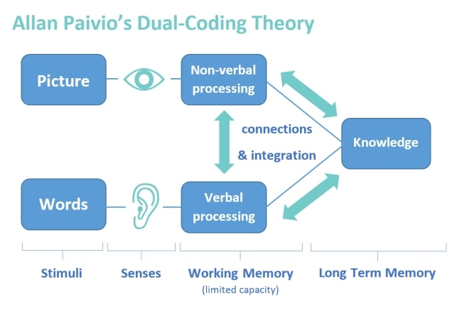

```{r setup, include=FALSE}
library(knitr)
options(htmltools.dir.version = FALSE)
opts_chunk$set(
  warning = FALSE,
  message = FALSE,
  echo = FALSE,
  cache.path = 'cache/',
  fig.align = 'center',
  cache = FALSE
)
library(anicon)

```
```{r xaringan-themer, include=FALSE, warning=FALSE}
library(xaringanthemer)
style_mono_accent(
   base_color = "#002c54",
   title_slide_background_color = "#031642",
  inverse_background_color = "#002c54",
  header_font_google = google_font("Josefin Sans"),
  text_font_google   = google_font("Montserrat", "300", "300i"),
  code_font_google   = google_font("Fira Mono"),
  title_slide_text_color = "#ffea00",
  inverse_header_color = "#ffea00",
   header_background_text_color = "#ffea00",
   text_font_size = "1.2rem",
   text_font_url = "#ffea00",
  header_font_url = "#ffea00",
  inverse_link_color = "#d70dde"
  )
```


class: inverse, middle, center

# What is Data Visualisation?

--

Data visualization is the act of presenting data in visual formats, such as charts and graphs, to make it easier to understand, analyze, and communicate insights.

---
class: inverse, middle, center

# "Data visualization should be the first step in any analysis"

```{r   out.width = "80%", echo = FALSE, fig.cap=''}
knitr::include_graphics("fig/data-science.png")

```

--

# Why?

---

## Allan Paivio's Dual Coding Theory

```{r   out.width = "70%", echo = FALSE, fig.cap=''}


```


---
class: inverse, middle, center

# Why learn  both R and Python?

```{r   out.width = "50%", echo = FALSE, fig.cap=''}
knitr::include_graphics("fig/rpython.png")

```
---
.pull-left[

#### `DSjobtracker` R Package (on CRAN, 2020)

DSjobtracker: What Skills and Qualifications are Required for Data Science Related Jobs?

<font size="4">by Statistical Consultancy Service, <br/>
University of Sri Jayewardenepura, 2020
https://thiyangt.github.io/DSjobtracker/
 </font>

```{r   out.width = "50%", echo = FALSE}
knitr::include_graphics("fig/DSjobtrackerhexsticker.png")
```

].pull-right[

#### Top twenty skills required for data science jobs

```{r out.width = "100%"}
library(DSjobtracker)
library(tidyr)
library(magrittr)
library(dplyr)
library(ggplot2)
library(viridis)
library(forcats)

theme_set(theme_minimal())

skills_long <- DStidy %>%
  select(c(R:Bahasa_Malaysia)) %>%
  pivot_longer(c(R:Bahasa_Malaysia), values_to = "Value", names_to = "Name") %>%
  mutate(Value = as.numeric(levels(Value))[Value]) %>%
  group_by(Name) %>%
  summarize(Total = sum(Value)) %>%
  arrange(Total)

p<- skills_long %>%
  mutate(Name = factor(Name, levels = .$Name)) %>%
  top_n(20) %>%
  ggplot(aes(x = Name, y = Total)) +
  geom_bar(stat = "identity") +
  geom_label(aes(label = Total),
    nudge_y = -10, size = 5,
    label.padding = unit(0.125, "lines")
  ) +
  coord_flip() +
  labs(
    x = "Skill Required", y = "No of job vacancies"
  )+
  theme(text = element_text(size=20))

print (p)
```
]
<!--Both of these datasets contain information about job vacancies related to data science-->
---


class: inverse, middle, center

# R Vs Python 

---
class: inverse, middle, center


# ~~R Vs Python~~

# R AND Python 
--

```{r out.width = "40%"}
library(tibble)
library(tidyverse)
skills <- c("R and Python", "Python only", "Other Statistical SW", "R, SAS & Python only", "SAS only" )
count <- c(124,91,67,26,13)
data <- tibble(skills, count)


p<- data %>%
  ggplot(aes(x = reorder(skills, count) , y = count)) +
  geom_bar(stat = "identity") +
  geom_label(aes(label = count),
    nudge_y = -10, size = 5,
    label.padding = unit(0.125, "lines")
  ) +
  coord_flip() +
  labs(
    x = "Skill Required", y = "No of  advertisements"
  )+
  theme(text = element_text(size=20))
print(p)
```
---
class: inverse, middle, center


# ~~R Vs Python~~

# R AND Python 

<!--`r anicon::faa("bell", animate="ring", size =1.5, speed = "fast")`
-->


```{r   out.width = "15%", echo = FALSE, fig.cap=''}
knitr::include_graphics("fig/Rlogo.png")

```

 +
```{r   out.width = "20%", echo = FALSE, fig.cap=''}
knitr::include_graphics("fig/python.png")

```


---
background-image:url('fig/posit.png')
background-position: 50% 50%
background-size: 100%
class: top, center, inverse

---

class: inverse, middle, center

# Problem-Solving Focus

--

## Language is just one component of the overall problem-solving process

---

background-image:url('fig/superpower.png')
background-position: 50% 50%
background-size: 50%
class: top, center