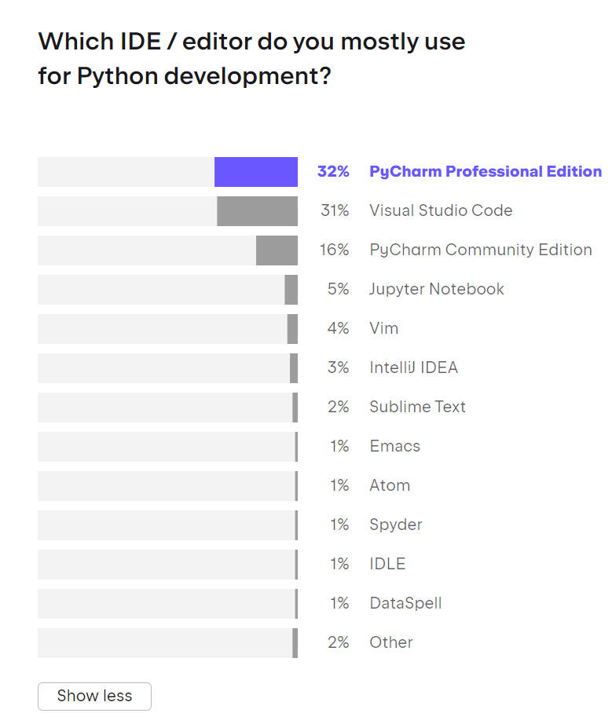

```{r setup, include=FALSE}
library(knitr)
options(htmltools.dir.version = FALSE)
opts_chunk$set(
  warning = FALSE,
  message = FALSE,
  echo = FALSE,
  cache.path = 'cache/',
  fig.align = 'center',
  cache = FALSE
)
library(anicon)

```
```{r xaringan-themer, include=FALSE, warning=FALSE}
library(xaringanthemer)
style_mono_accent(
   base_color = "#002c54",
   title_slide_background_color = "#031642",
  inverse_background_color = "#002c54",
  header_font_google = google_font("Josefin Sans"),
  text_font_google   = google_font("Montserrat", "300", "300i"),
  code_font_google   = google_font("Fira Mono"),
  title_slide_text_color = "#ffea00",
  inverse_header_color = "#ffea00",
   header_background_text_color = "#ffea00",
   text_font_size = "1.2rem",
   text_font_url = "#ffea00",
  header_font_url = "#ffea00",
  inverse_link_color = "#d70dde"
  )
```


class: inverse, middle, center

- RStudio is the most popular and widely used Integrated Development Environment (IDE) for R programming. 

-  Python has a wide variety of Integrated Development Environments (IDEs) available, which can sometimes be overwhelming for beginners.

- Ultimately, the best choice depends on your specific requirements, workflow, and personal preferences.
---


#### The State of Developer Ecosystem 2022

.pull-left[
-  sixth annual survey conducted by JetBrains to capture the landscape of the developer community

-  29,269 developers

].pull-right[
```{r   out.width = "90%", echo = FALSE, fig.cap='' }

```
]


<!--

survey reports Available at: https://www.jetbrains.com/lp/devecosystem-2022/


- This report has been created based on the responses of 29,269 developers from around the world who participated in our study in May–July 2022.

- It covers a wide range of topics, including programming languages, tools, technologies, demographics, and even fun facts, as well as the lifestyle of developers.
-->


---


class: inverse, middle, center

# The closest equivalent to RMarkdown in Python is Jupyter Notebook 

- PyCharm and Visual Studio Code (VS Code) are commonly used by developers.

- Jupyter Notebook is  more popular among data scientists compared to PyCharm and Visual Studio Code (VS Code).

<!--

Data Exploration and Visualization Challenges

- VS Code: While VS Code supports various data visualization libraries and extensions, Jupyter Notebook provides a more integrated and interactive environment for visualizations. In VS Code, visualizations might require additional configuration and setup compared to Jupyter Notebook.


- PyCharm: PyCharm has support for data visualization libraries, but it may require more manual effort to generate and display visualizations compared to the interactive capabilities of Jupyter Notebook.

-->

---

## Jupyter notebook


- Open-source web-based interactive computing environment that allows you to create and share documents containing live code, visualizations, narrative text, equations, and interactive elements.

--

- It provides an interface where you can write and execute code, view the results, and combine it with explanatory text and rich media content.

--

- The name "Jupyter" is a combination of three programming languages: Julia, Python, and R, which were the initial languages supported when it was first developed. 

--

- One of the most important advantages of Jupyter Notebook is its support for reproducibility.

--

- Jupyter Notebook provides a complete record of the code, data, and analysis steps, allowing others to reproduce the results and verify the findings
